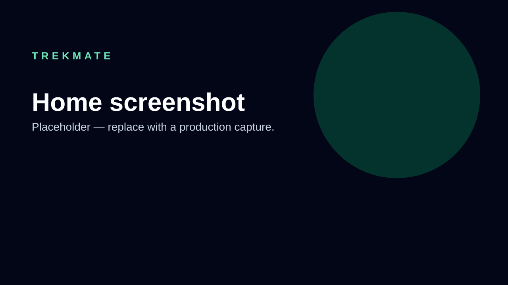
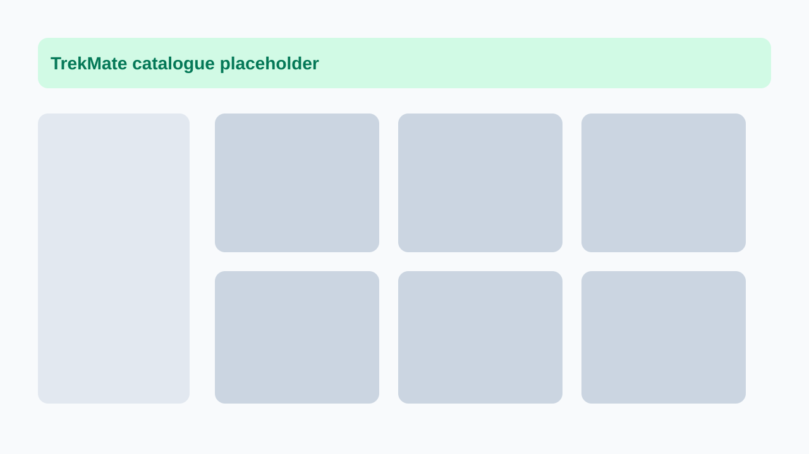
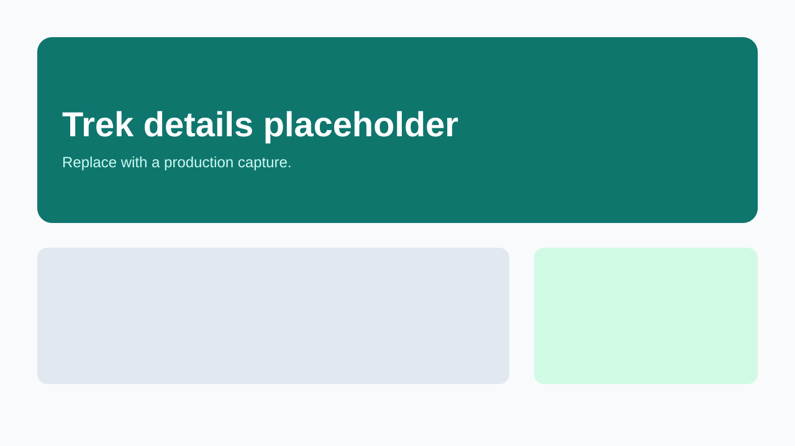
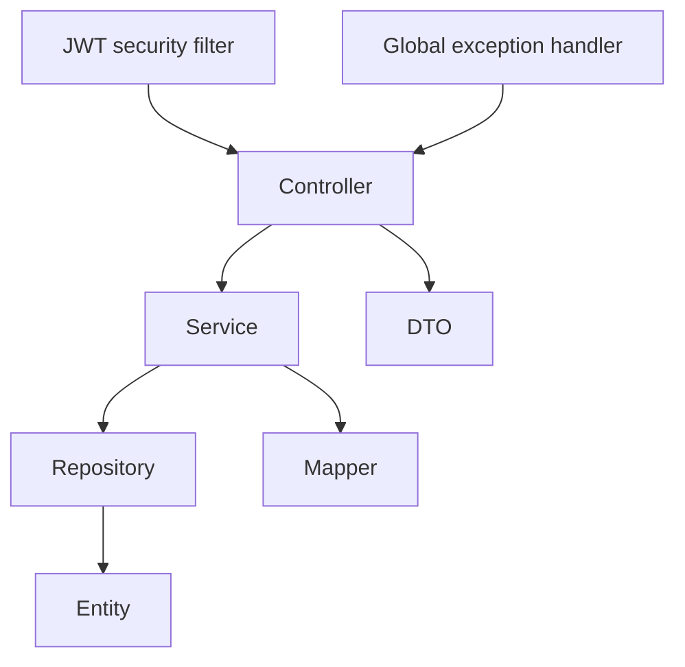

# TrekMate

TrekMate is a full-stack platform for discovering Indian treks, comparing trail details, saving favorites, reviewing routes, and checking current weather conditions.

> Screenshots are intentionally kept as placeholders until a stable public environment is available.

| Home | Trek catalogue | Trek details |
| --- | --- | --- |
|  |  |  |

## Architecture

```mermaid
flowchart LR
    Browser[React + Vite SPA] -->|HTTPS / API proxy| Nginx
    Nginx -->|Static files| Browser
    Nginx -->|/api| Backend[Spring Boot 3 / Java 21]
    Backend -->|JPA + Flyway (production)| PostgreSQL[(PostgreSQL 16)]
    Backend -->|Current weather| OpenWeather[OpenWeather API]
```



## Features

- JWT registration, login, protected profile, and automatic frontend logout
- Database-managed `ADMIN` role for trek mutations; registration always assigns `USER`
- Trek CRUD, filtering, pagination, and sorting
- User favorites and owner-protected trek reviews
- Protected saved-treks page at `/favorites`, synchronized favorite controls, review creation/edit/delete, and database-calculated rating summaries
- Distinct trek image URLs managed as backend data and rendered consistently in trek cards and detail heroes
- OpenWeather integration with a 15-minute in-memory cache
- OpenAPI / Swagger documentation
- Flyway-managed schema migrations and seeded Indian trek data
- Responsive React UI with dark mode, loading skeletons, empty/error states, accessible navigation, and lazy-loaded route bundles

## Technology

| Area | Technology |
| --- | --- |
| Backend | Java 21, Spring Boot 3, Spring Data JPA, Spring Security |
| Data | MySQL 8.0 (local), PostgreSQL 16 (production), Flyway |
| Frontend | React, TypeScript, Vite, Tailwind, React Query |
| Delivery | Docker, Docker Compose, Nginx, GitHub Actions |

## Local development

### Backend

Requirements: Java 21, Maven 3.9+, and MySQL 8.0.

```sql
CREATE DATABASE trekmate CHARACTER SET utf8mb4 COLLATE utf8mb4_unicode_ci;
```

Configure environment variables such as `DB_URL`, `DB_USERNAME`, `DB_PASSWORD`, `JWT_SECRET`, and `OPENWEATHER_API_KEY`, then run:

```bash
mvn spring-boot:run
mvn verify
```

### Frontend

The frontend is maintained in the sibling `trekmate-frontend` directory.

```bash
cd ../trekmate-frontend
npm ci
npm run dev
```

## API documentation

When the backend is running:

- Swagger UI: `http://localhost:8080/swagger-ui.html`
- OpenAPI: `http://localhost:8080/api-docs`
- Health: `http://localhost:8080/api/v1/health`

| Group | Base path |
| --- | --- |
| Authentication | `/api/auth` |
| Current user | `/api/users/me` |
| Treks | `/api/treks` |
| Favorites | `/api/favorites` |
| Reviews | `/api/treks/{trekId}/reviews` |
| Weather | `/api/weather/{trekId}` |

## Production deployment

The Compose stack is maintained in the sibling [`trekmate-deployment`](../trekmate-deployment/README.md) directory. It builds the frontend and backend, runs PostgreSQL, and exposes a single Nginx entry point.

```bash
cd ../trekmate-deployment
docker compose up --build -d
```

Open `http://localhost`, `http://localhost/api/v1/health`, or `http://localhost/swagger-ui.html`.

## Quality gates

GitHub Actions runs Maven verification and a Docker build on pushes and pull requests to `main`. The frontend repository has an equivalent Node/Vite workflow.

## Roadmap

- Password reset and email verification
- Admin dashboard for trek content management
- Review pagination and moderation
- Persistent distributed cache for weather data
- Image CDN and real trek photography
- Observability: structured logs, metrics, tracing, and alerts
- Automated unit, integration, and browser test coverage

## Security notes

Never commit `.env` files, database passwords, JWT secrets, or weather API keys. Use a strong `JWT_SECRET` of at least 32 characters in all non-development environments.

Trek write operations require the database-managed `ADMIN` role. Registration intentionally creates only `USER` accounts. Provision an administrator through an audited database administration process, for example:

```sql
UPDATE users SET role = 'ADMIN' WHERE email = 'trusted-admin@example.com';
```
